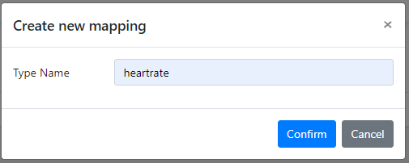
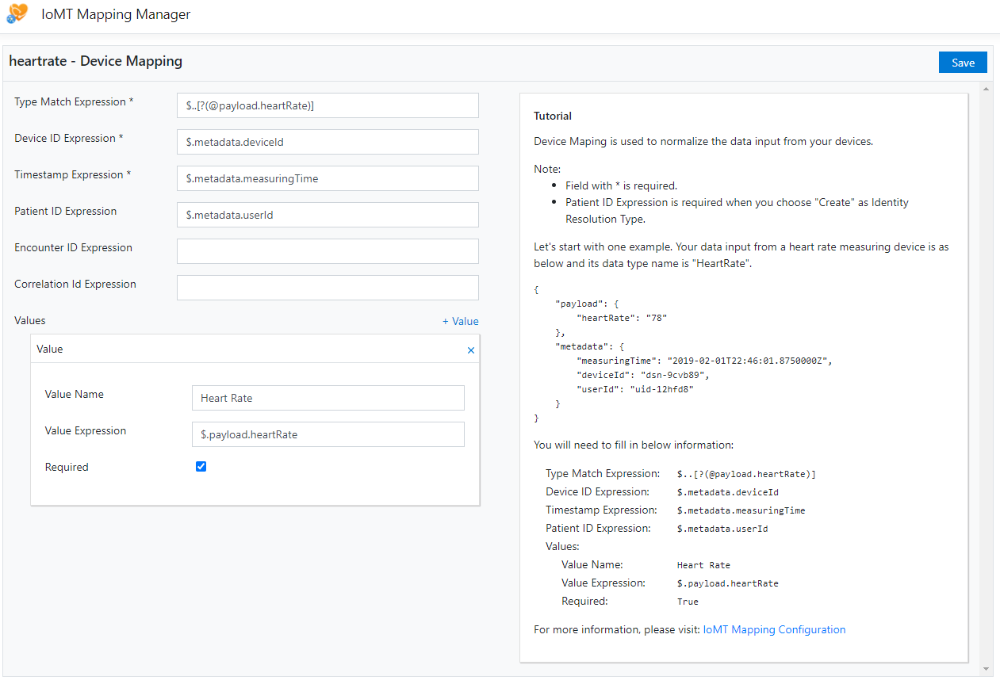

# IoMT Connector Data Mapper

## Introduction

The IoMT Connector Data Mapper is a tool to visualize the mapping configuration for normalizing the device input data and transform it to the FHIR resources. Developers can use this tool to edit and test the mappings, device mapping and FHIR mapping, and export them for uploading to the IoT Connector in the Azure portal. The tool also gives tutorials for developers to understand the mapping configuration.

## Setup and Requirement

Please make sure your machine meets the below system requirements:

### Client App

- **NodeJS** version 14.15.1 and above
- **npm** version 6.14.8 and above

To check NodeJS installation, use below commands:

  ```console
  node -v
  npm -v
  ```

  Installation of the ```NodeJS``` and ```npm```

- Install with official release: <https://nodejs.org/en/download/>.
- Install with ```brew```:

    ```brew
    brew install nodejs
    ```

- Install with ```choco```:

    ```choco
    choco install nodejs
    ```

### Server

- **.NET Core** version 3.1.9 and above

To check .NET installation, use below commands:

  ```console
  dotnet --version
  ```

Here is the official resource for installing .NET Core: <https://dotnet.microsoft.com/download/dotnet-core>.

### Npm

This tool is built with ReactJS. It requires Npm dependencies to build and run. The public default registry tested to work is ```https://registry.npmjs.org/```.

- If you are not sure about your Npm registry, you can run:
  ```
  npm config get registry
  ```
- If you want to use the public registry, you can run:
  ```
  npm config set registry https://registry.npmjs.org/
  ```
- If you need to use private registry, please make sure:
  - you are able to access your private registry
  - the registry has dependency packages and versions up to date

## Getting Started

### Start the IoMT Connector Data Mapper

1. Clone the repository. Go to the directory of this tool from the root of the repository.

   ```console
   cd tools/data-mapper/Microsoft.Health.Tools.DataMapper
   ```

2. Build the client code.

   ```console
   dotnet msbuild -target:PublishRunWebpack -property:NODE_ENV=production
   ```

3. Build and start the .NET Webapp.

   ```console
   dotnet run --project ./Microsoft.Health.Tools.DataMapper.csproj
   ```

4. The webapp should start now. Open the endpoint printed in the console in your browser for trying the tool.

   You may see the site is not secure because of the certificate used on the localhost. Since the tool should not handle any critical data and there is not any other internet connection, you can move forward in your browser.

### How to Make Mappings

1. Make sure you have read the introduction of [IoMT FHIR Connector for Azure](https://github.com/microsoft/iomt-fhir) and understand the purpose of its [configuration](https://github.com/microsoft/iomt-fhir/blob/master/docs/Configuration.md).
2. After you open the tool, you will see the empty list on the page. Now you can add a new mapping by clicking the "Add new mapping" button. You need to provide a unique name for the data type that the mapping should apply to.
   
3. Edit the device mapping. Based on your device data structure, you need to fill in the expressions for each mapping field. The syntax is the JSON path. Please check FAQs for common problems.
   
4. Test the device mapping. You can use the testing widget to test and verify your device mapping.
   
5. Edit the FHIR mapping. After you have tested the device mapping, that means your device data should be able to be normalized in runtime. Now you can start editing the FHIR mapping for describing how to transform and group the normalized data to the FHIR resource. Please check FAQs for common problems.
   
6. Test the FHIR mapping. You can use the testing widget to test and verify your FHIR mapping.
   
7. When you have done, you can go back to the mapping list page and start a new one.
8. When ready to export the mapping, you can click on "Export Mappings" and choose which ones you want to export. Once you get the mapping files, you can upload them to your IoT Connector in the Azure Portal or the OSS deployment.

## FAQ

1. **How to make correct "Type Match Expression"?**
   Type Match Expression is for IoT Connector to filter the incoming device data for the specific data type defined on the present mapping. Once it found a matching data blob, it may be partially based on the given JSON path, the IoT Connector will apply the other expressions to that data blob.

   For example, if the incoming device data is

   ```JSON
    {
        "payload": {
            "heartRate": "78"
        },
        "metadata": {
            "measuringTime": "2019-02-01T22:46:01.8750000Z",
            "deviceId": "dsn-9cvb89",
            "userId": "uid-12hfd8"
        }
    }
   ```

   The type match expression ```$..[?(@heartRate)]``` will return the ```payload``` data blob, you will not be able to find other metadata information with the other expressions. Instead, you want to use ```$..[?(@payload.heartRate)]``` which will return the root data blob, then you can use, for example, ```$.metadata.deviceId``` to map the device ID.
2. **When the "Patient ID Expression" is required?**
   The FHIR resource needs to link a Patient resource reference for the Observation resource for the device data. If you choose "Create" as the Identity Resolution Type, then the "Patient ID Expression" must be provided. Otherwise, it assumes that the Patient resource has been linked, so the "Patient ID Expression" is not required. However, it may fail when the Patient Resource reference can not be found in the runtime.

## Contributing

This project welcomes contributions and suggestions.  Most contributions require you to agree to a
Contributor License Agreement (CLA) declaring that you have the right to, and actually do, grant us
the rights to use your contribution. For details, visit <https://cla.microsoft.com>.

When you submit a pull request, a CLA-bot will automatically determine whether you need to provide
a CLA and decorate the PR appropriately (e.g., label, comment). Simply follow the instructions
provided by the bot. You will only need to do this once across all repos using our CLA.

There are many other ways to contribute to IoMT FHIR Connector for Azure.

- [Submit bugs](https://github.com/Microsoft/iomt-fhir/issues) and help us verify fixes as they are checked in.
- Review the [source code changes](https://github.com/Microsoft/iomt-fhir/pulls).
- Engage with IoMT FHIR Connector for Azure users and developers on [StackOverflow](https://stackoverflow.com/questions/tagged/iomt-fhir-connector-for-azure).
- [Contribute bug fixes](CONTRIBUTING.md).

See [Contributing to IoMT FHIR Connector for Azure](CONTRIBUTING.md) for more information.

This project has adopted the [Microsoft Open Source Code of Conduct](https://opensource.microsoft.com/codeofconduct/).
For more information see the [Code of Conduct FAQ](https://opensource.microsoft.com/codeofconduct/faq/) or
contact [opencode@microsoft.com](mailto:opencode@microsoft.com) with any additional questions or comments.

FHIR&reg; is the registered trademark of HL7 and is used with the permission of HL7.
